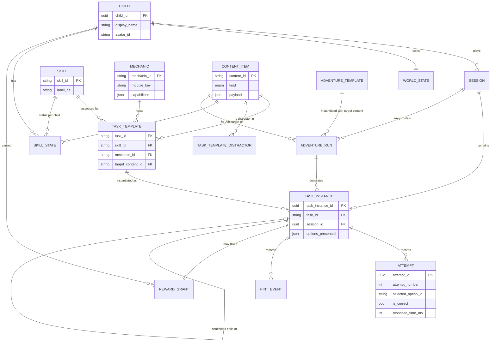
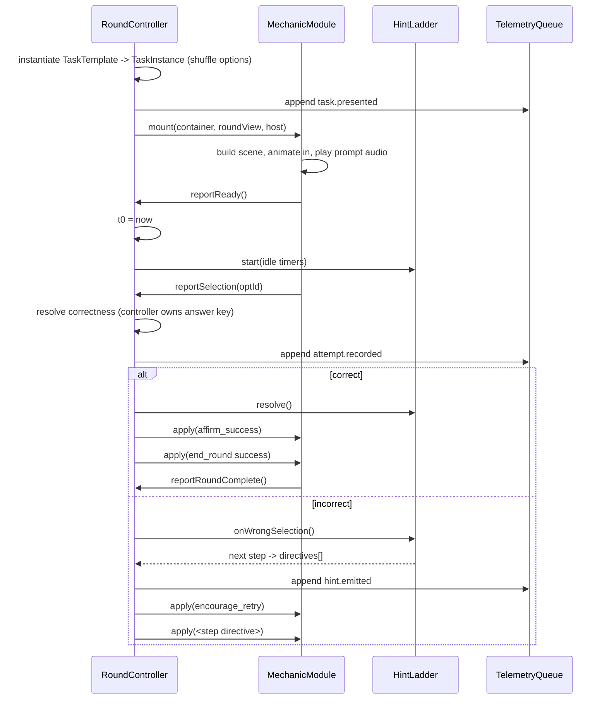
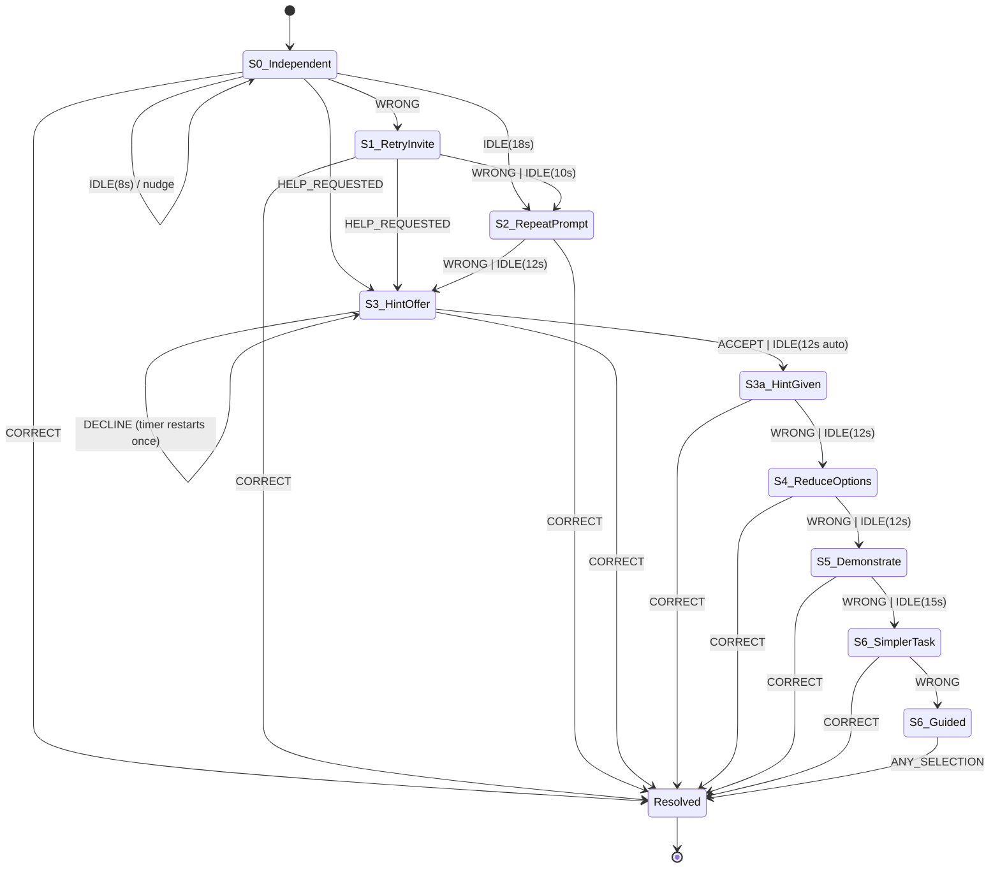

# ארכיטקטורה — המסע הסודי (MVP rebuild)

> **Editor's note (added on persist — read before acting on this document):**
>
> 1. **Correction.** An earlier draft claimed `narration-manifest.json` is
>    mojibake-encoded. **This is false and was verified false.** The file is
>    valid UTF-8; it only *renders* as `׳׳™ ׳׳©׳—׳§` when read through Windows
>    PowerShell's console, which defaults to CP1255. Read Hebrew files with
>    `-Encoding UTF8` (or the editor's own reader). The manifest should still be
>    regenerated from `copy.csv` — but because it describes the *old* game, not
>    because it is corrupt.
> 2. **Known gap.** This document was written stack-neutral and **predates** the
>    client's production brief (serverless Node, managed Postgres + ORM,
>    Supabase/Firebase auth with JWTs, Stripe subscriptions, Cloudflare CDN).
>    It therefore has **no parent-account, authentication, or subscription
>    model**: `Child` is a root entity with a client-generated id, and
>    `POST /v1/children` and `POST /v1/events` are unauthenticated. Under the
>    production brief the **parent** is the auth principal and the Stripe
>    customer, and children are owned sub-entities that never hold credentials.
>    Every endpoint in §6.4 must be re-scoped to the authenticated parent, and
>    every parent-dashboard read must enforce object-level authorization.
>    **Reconcile before implementing §6.**
>
> Stack-neutral by design elsewhere. Where a decision depends on the
> framework/DB/hosting choice, this document defines the **seam** and states the
> **requirement the stack must satisfy** — see `docs/research-findings.md` for
> the choice itself, `docs/design-direction.md` for visual direction.
>
> Source of truth for requirements: `docs/client-spec-mvp.md`. Every acceptance
> criterion referenced by number below is contractual.

---

## 0. The one architectural idea

The client spec asks, four separate times and in four different sections, for the same thing: **skill, mechanic, and content must be three independent axes that can each be replaced without touching the other two.** The existing vanilla-JS app fails this because each station file *is* its own skill definition, its own mechanic, its own content bank, and its own wrong-answer handler simultaneously. Seven stations, seven copies of everything.

The rebuild inverts this. There is exactly **one** round controller, **one** hint ladder, **one** assessment engine. Mechanics are dumb presentation shells that cannot see content or skills. Content is data compiled from spreadsheets. Skills exist only as ids in a table and as keys in the assessment engine.

Everything below is a consequence of that inversion.

---

## 1. Domain model

### 1.1 Entity diagram



Read the three-way separation off the diagram directly: `SKILL`, `MECHANIC` and `CONTENT_ITEM` have **no edges to each other**. Their only meeting point is `TASK_TEMPLATE`, which is a *data row*, not code.

### 1.2 Type definitions

```ts
// ─────────────────────────────────────────────────────────────
// AXIS 1 — SKILL. "What is being assessed."
// Owns no presentation, no content, no thresholds.
// ─────────────────────────────────────────────────────────────
type SkillId =
  | 'visual_letter_recognition'   // 1.3 #1  זיהוי חזותי של אותיות
  | 'letter_name_recognition'     // 1.3 #2  הכרת שם האות
  | 'letter_sound_correspondence' // 1.3 #3  קשר בסיסי אות–צליל
  | 'opening_sound_recognition'   // 1.3 #4  זיהוי צליל פותח
  | 'niqqud_combination_recognition'; // 1.3 #5+#6  אות עם קמץ/פתח + צליל "אָה"

interface Skill {
  skillId: SkillId;
  labelHe: string;              // shown on the parent screen, spec 14.3
  descriptionHe: string;
  /** Content kinds this skill can legally be assessed with. Build-time check only. */
  admissibleContentKinds: ContentKind[];
  /** Skill this one falls back to at hint-ladder step 6 ("מיומנות קרובה", spec 1.5 #5). */
  simplerSkillId: SkillId | null;
}

// ─────────────────────────────────────────────────────────────
// AXIS 2 — MECHANIC. "How the child interacts."
// Owns no content, no skill, no correctness rule.
// ─────────────────────────────────────────────────────────────
type MechanicId =
  | 'balloon_game'      // 1.2 #1  פיצוץ בלונים
  | 'fishing_game'      // 1.2 #2  דיג אותיות
  | 'letter_train_game' // 1.2 #3  רכבת האותיות
  | 'match_game'        // section 15 "התאמה" / "תמונות" / "ניקוד" rows
  | 'trace_game';       // section 10.5, remedial step 3

interface Mechanic {
  mechanicId: MechanicId;
  labelHe: string;
  moduleKey: string;            // resolved through the mechanic registry
  capabilities: MechanicCapabilities;
}

interface MechanicCapabilities {
  /** Which option renderings this mechanic can draw. */
  optionKinds: OptionKind[];    // 'glyph' | 'image' | 'audio' | 'trace'
  minOptions: number;           // spec 1.3 (content): 2 minimum
  maxOptions: number;           // spec 1.3 (content): 4 maximum
  /** Hint-ladder steps this mechanic can physically execute. */
  supportsRepeatPrompt: boolean;
  supportsHighlightOption: boolean;
  supportsRemoveOptions: boolean;
  supportsDemonstrate: boolean;
}

// ─────────────────────────────────────────────────────────────
// AXIS 3 — CONTENT. "Which letter / word / combination."
// Owns no skill, no mechanic, no interaction.
// ─────────────────────────────────────────────────────────────
type ContentKind = 'letter' | 'letter_sound' | 'niqqud_combo' | 'word';

/**
 * Namespaced ids: 'letter:mem', 'letter_sound:m', 'niqqud_combo:mem_patah',
 * 'word:matara'. One namespace so spec §17's single `target_content_id`
 * field can carry every content kind without a discriminator column.
 */
type ContentId = string;

interface ContentItemBase {
  contentId: ContentId;
  kind: ContentKind;
  /** Letter this item belongs to. Drives the remedial adventure's targeting
   *  and the "same letter across mechanics" evidence grouping. */
  rootLetterId: ContentId | null;
}

interface LetterContent extends ContentItemBase {
  kind: 'letter';
  glyph: string;                // "מ"
  nameHe: string;               // "מֵם"  (spec 1.5 table)
  baseSound: string;            // "מ"
  audio: { name: AudioRef; sound: AudioRef };
}

interface LetterSoundContent extends ContentItemBase {
  kind: 'letter_sound';
  stretchedHe: string;          // "ממממ"  (spec §7)
  audio: { sound: AudioRef };
  exampleWordId: ContentId | null; // "כמו במילה מַטָּרָה" — spec §7 hint
}

interface NiqqudComboContent extends ContentItemBase {
  kind: 'niqqud_combo';
  glyph: string;                // "מַ"  (spec 9.3 bank)
  mark: 'patah' | 'qamats' | 'hiriq' | 'holam' | 'shuruq' | 'tsere' | 'qubuts';
  audio: { combo: AudioRef };
}

interface WordContent extends ContentItemBase {
  kind: 'word';
  textHe: string;               // "מַטָּרָה"  (spec 8.3 bank)
  openingSoundContentId: ContentId; // 'letter_sound:m'
  image: ImageRef;
  audio: { word: AudioRef; stretchedOpening: AudioRef };
}

type ContentItem =
  | LetterContent | LetterSoundContent | NiqqudComboContent | WordContent;

// ─────────────────────────────────────────────────────────────
// THE JOIN — the only place the three axes meet. Pure data.
// ─────────────────────────────────────────────────────────────
interface TaskTemplate {
  taskId: string;               // 'BAL-001' … spec §15
  skillId: SkillId;
  /** Secondary skills also evidenced by this task (spec 4.5 lists two
   *  skill_ids for the balloon game). First entry of [skillId, ...also]
   *  is primary; all receive evidence, only the primary drives adaptation. */
  alsoEvidences: SkillId[];
  mechanicId: MechanicId;
  targetContentId: ContentId;
  distractorContentIds: ContentId[];
  defaultOptionCount: 2 | 3 | 4;
  /** Copy ids, never literal strings — see §2.4. */
  promptCopyId: CopyId;
  feedbackCorrectCopyId: CopyId;
  feedbackRetryCopyId: CopyId;
  hintCopyIds: [CopyId, CopyId];      // spec 1.1(content): רמז ראשון, רמז שני
  simplerTaskId: string | null;       // spec 1.1(content): משימה פשוטה יותר
  rewardRule: RewardRule;
}

// ─────────────────────────────────────────────────────────────
// RUNTIME / TELEMETRY
// ─────────────────────────────────────────────────────────────
interface Child {
  childId: string;              // uuid, client-generated
  displayName: string | null;   // spec 2.2 allows skipping
  avatarId: string;             // spec 2.3, 4 options
  createdAt: string;
}

interface Session {
  sessionId: string;            // uuid, client-generated at session start
  childId: string;
  startedAt: string;
  endedAt: string | null;       // null = quit mid-session; NOT an error state
  clientAppVersion: string;
  contentPackVersion: string;   // pins what the child actually saw
}

interface TaskInstance {
  taskInstanceId: string;       // uuid — spec 1.4 #1 "מזהה ייחודי לכל משימה"
  taskId: string;
  sessionId: string;
  childId: string;
  skillId: SkillId;             // denormalised — spec 1.4 #8 separate fields
  mechanicId: MechanicId;       // denormalised — spec 1.4 #8 separate fields
  targetContentId: ContentId;
  optionsPresented: PresentedOption[];
  optionCount: 2 | 3 | 4;
  /** Set when this instance is a hint-ladder step-6 simplification of another.
   *  Scaffolded instances count as *exposure* but never as mastery evidence. */
  derivedFromTaskInstanceId: string | null;
  isScaffolded: boolean;
  /** Set when the instance was generated inside a remedial adventure. */
  adventureRunId: string | null;
  presentedAt: string;
  optionsReadyAt: string | null;  // starts the response clock, spec 1.4 #4
  resolvedAt: string | null;
  outcome: TaskOutcome | null;    // null = abandoned mid-task, kept as-is
  rewardGrantId: string | null;
}

interface PresentedOption {
  optionId: string;             // stable within the instance
  contentId: ContentId;
  isTarget: boolean;
  position: number;             // as rendered, for replay
  removedAtLadderStep: number | null; // set when step 4 culls a distractor
}

type TaskOutcome =
  | 'first_try_correct'      // הצלחה עצמאית, ניסיון ראשון
  | 'correct_after_retry'    // הצלחה מאוחרת ללא רמז
  | 'correct_after_hint'     // הצלחה לאחר רמז — spec 1.5 requires separate record
  | 'correct_after_demo'     // ladder terminal, assisted
  | 'abandoned';             // child left / navigated away

interface Attempt {
  attemptId: string;
  taskInstanceId: string;
  attemptNumber: number;        // 1-based, spec §17
  selectedOptionId: string;
  selectedContentId: ContentId;
  isCorrect: boolean;
  /** ms from optionsReadyAt (attempt 1) or from previous attempt (n>1). */
  responseTimeMs: number;
  ladderStepAtAttempt: number;  // 0..6 — which hint state was active
  occurredAt: string;
}

interface HintEvent {
  hintEventId: string;
  taskInstanceId: string;
  ladderStep: number;                 // 1..6, spec §11
  hintType: HintType;
  trigger: 'wrong_selection' | 'idle_timeout' | 'child_requested' | 'declined_then_auto';
  acceptedByChild: boolean | null;    // spec §11 step 3 offers כן / לא עכשיו
  occurredAt: string;
}

type HintType =
  | 'retry_invite' | 'repeat_prompt' | 'audio_hint' | 'visual_highlight'
  | 'reduce_options' | 'demonstrate' | 'simpler_task';

interface SkillState {
  childId: string;
  skillId: SkillId;
  /** null = skill-level rollup (what the parent screen shows).
   *  non-null = per-letter rollup (what the remedial trigger reads). */
  contentScopeId: ContentId | null;
  status: 'חדש' | 'בתרגול' | 'הצלחה עקבית';   // spec 1.4 #9, 1.9
  exposures: number;
  firstTryCorrect: number;
  hintAssisted: number;
  distinctMechanics: MechanicId[];
  lastNOutcomes: TaskOutcome[];       // rolling window, length = policy.window
  /** Opaque to everything except the active ScoringStrategy. Lets BKT/Elo
   *  be swapped in without a schema migration. See §4.4. */
  strategyState: Record<string, unknown>;
  strategyId: string;
  needsReinforcement: boolean;        // the remedial trigger flag
  reinforcedAtSessionId: string | null;
  updatedAt: string;
}

interface RewardGrant {
  rewardGrantId: string;
  childId: string;
  /** spec 1.7: ONE resource type only. Coins are the resource. */
  coins: number;
  /** Unlockables are not currency — they are world items. */
  unlockedItemId: string | null;
  sourceTaskInstanceId: string | null;
  sourceAdventureRunId: string | null;
  grantedAt: string;
}

interface WorldState {
  childId: string;
  coinBalance: number;
  ownedItemIds: string[];       // spec 1.8: item survives quit-and-return
  placedItems: { itemId: string; x: number; y: number }[];
  gateState: 'closed' | 'glowing' | 'open';   // spec §3, §12
  unlockedAreaIds: string[];
  updatedAt: string;
}

interface AdventureTemplate {
  adventureId: 'lost_signs_mystery';  // spec §10
  /** Steps are parameterised generators, NOT fixed tasks. */
  steps: AdventureStepTemplate[];
  openingCopyIds: CopyId[];
  closingCopyIds: CopyId[];
  rewardRule: RewardRule;
}

interface AdventureStepTemplate {
  stepIndex: number;
  mechanicId: MechanicId;
  skillId: SkillId;
  /** How to derive this step's target from the run's target letter.
   *  'same' → the letter itself; 'sound_of' → its letter_sound;
   *  'trace_of' → its stroke path. This is the swappability mechanism. */
  contentDerivation: 'same' | 'sound_of' | 'trace_of';
  optionCount: 2 | 3;
  copyIds: { prompt: CopyId; success: CopyId; hint: CopyId };
}

interface AdventureRun {
  adventureRunId: string;
  adventureId: string;
  childId: string;
  sessionId: string;
  /** The single parameter that re-targets the whole adventure. spec 1.6 AC. */
  targetLetterContentId: ContentId;
  triggeredBySkillId: SkillId;
  triggerEvidenceSnapshot: SkillState;  // audit trail for criterion 3.8/3.9
  startedAt: string;
  completedAt: string | null;
}
```

### 1.3 How each swappability requirement is satisfied

| Spec requirement | Mechanism | Why it holds |
|---|---|---|
| **1.2 AC** "ניתן להחליף מכניקה בלי לשנות את הגדרת המיומנות" | `TaskTemplate.mechanicId` is a foreign key in a **CSV row**. `Skill` has no `mechanicId` field anywhere. | Changing `BAL-001`'s mechanic from `balloon_game` to `fishing_game` is a one-cell spreadsheet edit. Zero code, zero skill-table change. Demonstrable to the client as a diff. |
| **1.10 AC / 3.12** "ניתן להוסיף מכניקה חדשה בלי לשנות את מבנה המיומנויות" | Mechanics are registered by `mechanicId` → module. The engine only ever calls `MechanicModule` methods and only ever reads `MechanicCapabilities`. `SkillId` is a closed union that no mechanic imports. | A new mechanic = one row in `mechanics.csv` + one module implementing the contract. The `Skill` type, the skills table, and the assessment engine are untouched — enforced by a lint rule (§3.6). |
| **§18 AC** "ניתן להחליף אות/תוכן בלי לשנות את קוד המכניקה" | The mechanic receives a `RoundView` containing `OptionView[]` — `{ optionId, kind, glyph?, imageRef?, audioRef?, labelHe }`. It never receives a `ContentId`, a `ContentItem`, a letter table, or a skill id. | A mechanic *cannot* branch on content because it cannot see content identity. Swapping מ for ג changes only which glyph string arrives. |
| **1.6 AC** "ניתן להפעיל את אותה הרפתקה עם אותיות שונות באמצעות החלפת תוכן בלבד" | `AdventureRun.targetLetterContentId` is a single parameter. Each `AdventureStepTemplate` declares a `contentDerivation` rule that resolves against it. | Running the adventure for ר instead of מ = passing a different `ContentId` to `startAdventure()`. Nothing else changes. Tested by parameterised test over all 8 MVP letters. |
| **1.4 #8 / 3.11** "`Skill ID` ו־`Game Mechanic ID` בשדות נפרדים" | `TaskInstance.skillId` and `TaskInstance.mechanicId` are separate denormalised columns on the telemetry row, indexed independently. | The parent-report query `GROUP BY skill_id, mechanic_id` answers criterion 3.11 directly: for each skill, which mechanics tested it and with what results. |
| **1.3 AC** "אותה מיומנות נבדקת ביותר ממכניקה אחת" | `visual_letter_recognition` appears in 15 of the 27 tasks across `balloon_game`, `fishing_game`, `letter_train_game`. | Falls out of the data, not out of code. |

### 1.4 Spec §17 mandatory-field coverage

Every field is derivable from one join. This table is the acceptance artifact for criterion 3.7 (≥95% of tasks produce a valid record).

| §17 field | Source |
|---|---|
| `child_id` | `TaskInstance.childId` |
| `session_id` | `TaskInstance.sessionId` |
| `task_id` | `TaskInstance.taskId` (+ `taskInstanceId` for uniqueness, spec 1.4 #1) |
| `skill_id` | `TaskInstance.skillId` |
| `mechanic_id` | `TaskInstance.mechanicId` |
| `target_content_id` | `TaskInstance.targetContentId` |
| `options_presented` | `TaskInstance.optionsPresented` |
| `selected_option` | last `Attempt.selectedOptionId` (all attempts retained) |
| `is_correct` | `TaskInstance.outcome ∈ {first_try_correct, correct_after_*}` |
| `attempt_number` | `count(Attempt)` for the instance |
| `response_time_ms` | `Attempt[0].responseTimeMs` (spec 1.4 #4: options-shown → choice) |
| `hint_used` | `exists(HintEvent) where ladderStep ≥ 3` |
| `hint_type` | `HintEvent.hintType` list, highest ladder step |
| `success_after_hint` | `outcome ∈ {correct_after_hint, correct_after_demo}` |
| `reward_granted` | `TaskInstance.rewardGrantId != null` |
| `timestamp` | `TaskInstance.presentedAt` |

A server-side validator (`GET /v1/parent/{childId}/data-quality`) computes the percentage of task instances with all 16 populated. **Build this in M1, not after the child sessions** — criterion 3.7 is a measurement, and you cannot measure it retroactively if the data was never captured.

---

## 2. The content pipeline

### 2.1 Decision: author in CSV, compile to a versioned JSON content pack

**Authoring format: UTF-8-with-BOM CSV, one file per table, opened in Excel.**

Rejected alternatives and why:
- *JSON authored by hand* — Hebrew with niqqud in a JSON file is unreadable and un-diffable for a non-programmer, and combining marks silently get mangled by editors. Non-starter for the actual content author (a Hebrew-speaking educator).
- *A CMS/admin UI* — correct long-term, but it is a whole second product. Not in an MVP whose goal is testing with five children.
- *Google Sheets export* — attractive, but adds a network dependency to the build and no offline story. Revisit post-MVP; the CSV shape is deliberately Sheets-compatible so the migration is an export.

CSV wins on exactly one axis that matters more than the others here: **the content author can open it, read the Hebrew correctly, and see the niqqud render.**

### 2.2 Layout

```
content/
  source/                       ← authored by a human, hand-editable
    skills.csv
    mechanics.csv
    letters.csv                 ← spec 1.4 + 1.5
    letter-sounds.csv           ← spec §7
    niqqud-combos.csv           ← spec 9.3
    words.csv                   ← spec 8.3
    tasks.csv                   ← spec §15, the 27 rows
    adventures.csv
    adventure-steps.csv         ← spec §10.3–10.6
    copy.csv                    ← every Hebrew string in the game
  schema/
    *.schema.json               ← JSON Schema per table
    forbidden-phrases.txt       ← spec §21, enforced by the linter
  build/
    content-pack.v{n}.json      ← generated, immutable, hashed. Never edited.
    content-pack.v{n}.json.sha256
```

`npm run content:build` reads `source/`, validates, and emits a single immutable pack. `npm run content:lint` runs validation only, and is part of `npm run verify`.

### 2.3 The tables, mapped to the spec

**`letters.csv`** — spec 1.4 (8 letters) + 1.5 (name/sound table):

```csv
content_id,glyph,name_he,base_sound,audio_name,audio_sound,in_mvp
letter:alef,א,אָלֶף,,name-alef.mp3,sound-alef.mp3,true
letter:mem,מ,מֵם,מ,name-mem.mp3,sound-mem.mp3,true
letter:shin,ש,שִׁין,ש,name-shin.mp3,sound-shin.mp3,true
letter:resh,ר,רֵישׁ,ר,name-resh.mp3,sound-resh.mp3,true
letter:dalet,ד,דָּלֶת,ד,name-dalet.mp3,sound-dalet.mp3,true
letter:lamed,ל,לָמֶד,ל,name-lamed.mp3,sound-lamed.mp3,true
letter:bet,ב,בֵּית,ב,name-bet.mp3,sound-bet.mp3,true
letter:gimel,ג,גִּימֶל,ג,name-gimel.mp3,sound-gimel.mp3,true
```

**`words.csv`** — spec 8.3, the opening-sound word bank:

```csv
content_id,text_he,root_letter_id,opening_sound_id,image,audio_word,audio_stretched
word:matara,מַטָּרָה,letter:mem,letter_sound:m,matara.png,w-matara.mp3,s-matara.mp3
word:shemesh,שֶׁמֶשׁ,letter:shin,letter_sound:sh,shemesh.png,w-shemesh.mp3,s-shemesh.mp3
word:dag,דג,letter:dalet,letter_sound:d,dag.png,w-dag.mp3,s-dag.mp3
word:rekhev,רֶכֶב,letter:resh,letter_sound:r,rekhev.png,w-rekhev.mp3,s-rekhev.mp3
word:balon,בַּלוֹן,letter:bet,letter_sound:b,balon.png,w-balon.mp3,s-balon.mp3
word:gamal,גָּמָל,letter:gimel,letter_sound:g,gamal.png,w-gamal.mp3,s-gamal.mp3
word:lev,לֵב,letter:lamed,letter_sound:l,lev.png,w-lev.mp3,s-lev.mp3
word:shablul,שבלול,letter:shin,letter_sound:sh,shablul.png,w-shablul.mp3,s-shablul.mp3
```

**`niqqud-combos.csv`** — spec 9.3 bank plus the distractor marks that appear in §9.4's option lists (מִ, מוֹ, שִׁ, שוּ, דִ, דֻ, רֵ, רוֹ, בִּ, בּוֹ). Note that 9.3 gives only patah/qamats, but 9.4's rounds present hiriq/holam/shuruq/tsere/qubuts as distractors — **the bank must be widened to cover distractors, and every distractor combo needs its own audio recording** even though it is never the target. This is an easy thing to miss and it is a content-acceptance blocker (§18: "כל האותיות והצירופים נבדקו: כתיב, ניקוד, הקלטה").

**`tasks.csv`** — spec §15's 27 rows, one per line:

```csv
task_id,skill_id,also_evidences,mechanic_id,target_content_id,distractors,option_count,prompt_copy,feedback_correct_copy,feedback_retry_copy,hint1_copy,hint2_copy,simpler_task_id,reward
BAL-001,visual_letter_recognition,letter_name_recognition,balloon_game,letter:mem,letter:shin|letter:gimel,3,bal.prompt.find_letter,bal.ok.found,bal.retry.look_again,hint.listen_name,hint.starts_with_sound,BAL-001-S,coin:1
FIS-001,visual_letter_recognition,letter_name_recognition,fishing_game,letter:resh,letter:mem|letter:dalet,3,fis.prompt.fish_letter,fis.ok.caught,fis.retry.swam_away,hint.listen_name,hint.starts_with_sound,FIS-001-S,coin:1
PHO-001,opening_sound_recognition,,match_game,word:matara,word:dag|word:shemesh,3,pho.prompt.same_start,pho.ok.found,pho.retry.listen_first,hint.stretch_opening,hint.highlight_image,PHO-001-S,coin:1
NIK-003,niqqud_combination_recognition,,match_game,niqqud_combo:dalet_qamats,niqqud_combo:dalet_hiriq|niqqud_combo:dalet_qubuts,3,nik.prompt.which_combo,nik.ok.found,nik.retry.listen_again,hint.replay_combo,hint.highlight_letter,NIK-003-S,coin:1
```

**`copy.csv`** — every string the child or parent ever sees. Nothing else in the codebase may contain a Hebrew string literal (lint-enforced).

```csv
copy_id,text_he,audio_ref,tokens,notes
bal.prompt.find_letter,"פוצץ את הבלון עם האות {{letter_name}}",bal-prompt-find.mp3,letter_name,spec 4.2
bal.retry.look_again,"בוא נסתכל שוב על הסימנים.",bal-retry.mp3,,spec 4.4 step 1
hint.starts_with_sound,"האות שאנחנו מחפשים מתחילה בצליל {{sound}}",hint-sound.mp3,sound,spec 4.4 step 3
```

### 2.4 The content linter — this is where §18 becomes executable

`npm run content:lint` fails the build on any of:

1. **Referential integrity** — every `target_content_id`, `distractor`, `copy_id`, `skill_id`, `mechanic_id` resolves.
2. **§18: ≥5 tasks per mechanic.** (Currently balloon 5, fishing 5, train 5, match 12 — passes.)
3. **§18: every task has a voice instruction** — `prompt_copy.audio_ref` is non-empty and the file exists on disk.
4. **§18: every task has options + a correct answer + positive feedback + a wrong-choice response + ≥1 hint.**
5. **§18: a simpler task exists for every skill** — `simplerTaskId` resolves, or the skill has a `simplerSkillId`.
6. **§21 / 14.4 forbidden-phrase scan** over every string in `copy.csv`: `טעית`, `לא נכון`, `נכשלת`, `תשובה שגויה`, `ציון`, `חלש`, `בעייתי`, `מתקשה`, `אתה צריך להשתפר`, … Also scans the parent-screen copy against 14.4's forbidden list separately. **This is the single highest-leverage lint rule in the project** — it makes an untestable "don't say the wrong thing" requirement into a build failure.
7. **Scope guard (spec 1.3 #7 / 1.2 #8)** — every `content_id` used by any task has `in_mvp = true`; letters outside the 8 are rejected; no task requires distinguishing patah from qamats by sound alone (checked as: no task whose target and distractors differ only in patah-vs-qamats).
8. **Mechanic capability compatibility** — every task's option kinds ⊆ `mechanic.capabilities.optionKinds`, and `2 ≤ option_count ≤ mechanic.maxOptions`.
9. **Distractor sanity** — target ∉ distractors; distractor count ≥ `option_count - 1`; for `opening_sound_recognition`, no distractor shares the target's `opening_sound_id`.
10. **Asset presence** — every referenced audio/image file exists; missing files list printed as a to-record checklist.

Rule 10 is what turns audio recording from "we'll do it later" into a visible, shrinking list. Run it from day one and it doubles as the recording work-order.

### 2.5 How a non-programmer adds a letter

> Adding ק to the game:
> 1. Open `content/source/letters.csv` in Excel. Add a row: `letter:qof,ק,קוֹף,ק,name-qof.mp3,sound-qof.mp3,true`.
> 2. Save as CSV UTF-8.
> 3. Double-click `tools/Build-Content.ps1`. It says: `ERROR letters.csv:9 — audio file assets/audio/name-qof.mp3 not found (2 errors)`.
> 4. Record `name-qof.mp3` and `sound-qof.mp3`, drop them in `assets/audio/`.
> 5. Run it again: `OK — 9 letters, 8 words, 24 combos, 27 tasks, 0 errors → content-pack.v13.json`.
>
> ק now exists as a target and as a distractor everywhere the engine draws letters, and appears on the parent screen. **No code changed.**

### 2.6 How a non-programmer adds a task

> 1. Open `tasks.csv`, add: `BAL-006,visual_letter_recognition,letter_name_recognition,balloon_game,letter:qof,letter:kaf|letter:resh,3,bal.prompt.find_letter,bal.ok.found,bal.retry.look_again,hint.listen_name,hint.starts_with_sound,BAL-006-S,coin:1`
> 2. Rebuild. Done.

Note what did *not* have to happen: no new copy strings (they are templated with `{{letter_name}}`), no balloon-game code change, no skill change. That is the shape of the system working.

### 2.7 Stack seams

- **SEAM C1.** The build script is Node + a CSV parser + Ajv. Stack-independent. It must run on Windows PowerShell 5.1 from a single command with no shell tricks.
- **SEAM C2.** The pack is served as an immutable, content-hash-named static JSON file. Whatever the hosting choice, it must support long-lived cache headers on versioned static assets.
- **SEAM C3.** Audio/image assets are static files addressed by `AudioRef`/`ImageRef`. If the stack has an asset pipeline with hashing, the pack build must emit refs that survive it — resolve refs at runtime through a manifest, not by hardcoding paths.

---

## 3. The mechanic contract

### 3.1 The rule that makes it work

> **A mechanic never decides whether an answer is correct, never records anything, never chooses a hint, and never sees a skill or a content id.**

It renders a prompt, renders N options, and reports which one the child touched. Everything else belongs to the round controller. This is the direct fix for the existing app's seven-fold duplication of wrong-answer handling.

### 3.2 The interfaces

```ts
// ── What the mechanic is given ───────────────────────────────
interface RoundView {
  roundId: string;              // == taskInstanceId, but opaque to the mechanic
  prompt: {
    textHe: string;             // already token-substituted
    audioRef: AudioRef;
    /** Optional visual instruction, spec 1.2 #4. e.g. the train's gate sign. */
    displayGlyph?: string;
  };
  options: OptionView[];        // order already shuffled by the controller
  /** Purely cosmetic, from design-direction.md. Never behavioural. */
  theme?: { accentColor: string; sceneKey: string };
}

interface OptionView {
  optionId: string;             // opaque token. NOT a content id.
  kind: 'glyph' | 'image' | 'audio' | 'trace';
  glyph?: string;               // "מ" | "מַ"
  imageRef?: ImageRef;
  audioRef?: AudioRef;
  labelHe: string;              // accessibility label
  tracePath?: string;           // SVG path, for trace_game (spec 10.5)
}
```

`OptionView.optionId` is a per-instance opaque token — deliberately not the content id — so that a mechanic physically cannot key behaviour off "is this the מ tile".

```ts
// ── What the mechanic can do ─────────────────────────────────
interface MechanicHost {
  /** Options are on screen and touchable. Starts the response clock
   *  (spec 1.4 #4) AND the idle-timeout clock (spec 16.1). */
  reportReady(): void;

  /** The child touched an option. The mechanic does NOT know if it's right;
   *  it must await the returned directive before showing any feedback. */
  reportSelection(optionId: string): void;

  /** Child tapped the help affordance (spec §11 step 3 "רוצה רמז קטן?"). */
  requestHint(): void;

  /** Child answered the hint offer. */
  answerHintOffer(accepted: boolean): void;

  /** Celebration/animation finished; controller may advance. */
  reportRoundComplete(): void;

  /**
   * Narration playback. Goes through the host so the single-speech-channel
   * rule is central and un-bypassable (spec §1.6 rule ב׳).
   *
   * THERE IS NO QUEUE. Calling this immediately cancels whatever narration is
   * currently playing. The returned promise resolves on completion and
   * REJECTS with `NarrationInterrupted` if a newer call, a round advance, a
   * navigation, or a document-hidden event cut it short — so a caller can
   * never chain "…and then say the next thing" onto stale speech.
   *
   * Non-verbal effects (pop, chime) are a SEPARATE channel: see playEffect.
   * They are never cancelled and never cancel narration.
   */
  playNarration(ref: AudioRef): Promise<void>;

  /** Stops narration now. Called on selection, round advance, unmount, hide. */
  stopNarration(): void;

  /** Short non-verbal cue. Concurrent with narration, never interrupts it. */
  playEffect(name: EffectName): void;

  /** Non-fatal telemetry breadcrumb (e.g. "child tapped empty water"). */
  reportInteraction(kind: string, detail?: Record<string, unknown>): void;
}

// ── What the mechanic must obey ──────────────────────────────
type PresentationDirective =
  | { kind: 'affirm_success'; optionId: string; textHe: string; audioRef: AudioRef }
  | { kind: 'encourage_retry'; optionId: string; textHe: string; audioRef: AudioRef }
  | { kind: 'repeat_prompt' }
  | { kind: 'highlight_option'; optionId: string; intensity: 'soft' | 'strong' }
  | { kind: 'remove_options'; optionIds: string[] }
  | { kind: 'demonstrate'; optionId: string }
  | { kind: 'offer_hint'; textHe: string; audioRef: AudioRef }
  | { kind: 'nudge'; textHe: string; audioRef: AudioRef }   // spec 16.1 idle
  | { kind: 'end_round'; disposition: 'success' };          // always 'success'

interface MechanicHandle {
  apply(directive: PresentationDirective): Promise<void>;
  destroy(): void;
}

interface MechanicModule {
  readonly mechanicId: MechanicId;
  readonly capabilities: MechanicCapabilities;
  mount(
    container: HTMLElement,
    round: RoundView,
    host: MechanicHost,
  ): Promise<MechanicHandle>;
}
```

### 3.3 The interaction sequence



Three things to notice:

1. **`reportSelection` is fire-and-forget.** The mechanic does not get a boolean back — it gets a `PresentationDirective` pushed to it. This makes it impossible for a mechanic to invent its own success animation on a wrong answer, or to skip recording.
2. **`end_round.disposition` is always `'success'`.** There is no failure disposition in the type system. Spec 1.5 AC ("אין מצב שבו הילד נתקע ללא אפשרות להמשיך") and §21 are enforced by the absence of a representable failure state.
3. **Telemetry appends happen in the controller, before the animation.** Not after. This is the mid-session-quit guarantee (§6.3).

### 3.4 Capability negotiation

The hint ladder asks the mechanic's capabilities before choosing a step, and **falls through** to the next supported step if a mechanic cannot do one:

```ts
function nextExecutableStep(from: LadderStep, caps: MechanicCapabilities): LadderStep {
  for (let s = from + 1; s <= 6; s++) {
    if (s === 2 && !caps.supportsRepeatPrompt) continue;
    if (s === 3 && !caps.supportsHighlightOption) continue;
    if (s === 4 && !caps.supportsRemoveOptions) continue;
    if (s === 5 && !caps.supportsDemonstrate) continue;
    return s;   // step 6 (simpler task) is always available — controller-level
  }
  return 6;
}
```

Step 6 is never skippable because it is executed by the *controller* (swap in a different task), not the mechanic. That is the ladder's guaranteed floor.

### 3.5 Adding a fourth mechanic

Concretely, adding e.g. a "כוכבים נופלים" mechanic:

1. `mechanics.csv`: one row — `star_catch_game,כוכבים נופלים,starCatch,glyph|image,2,4,true,true,true,false`.
2. `src/mechanics/starCatch/StarCatchMechanic.ts` implementing `MechanicModule`.
3. Register it in `mechanicRegistry`.
4. Point some `tasks.csv` rows at `star_catch_game`.

Files not touched: skills, assessment engine, hint ladder, telemetry, parent dashboard, content schema. That is criterion 3.12, demonstrable as a diff.

### 3.6 Enforcement (this is not optional)

The three-way separation is a *property of the code*, and code decays. Enforce it mechanically:

- **ESLint `no-restricted-imports`** in `src/mechanics/**`: cannot import from `src/content/**`, `src/assessment/**`, `src/telemetry/**`, or anything exporting `SkillId`.
- **A lint rule banning Hebrew string literals** outside `content/`.
- **A conformance test suite** parameterised over the mechanic registry: every registered mechanic is mounted with a synthetic 3-option `RoundView`, driven through wrong→wrong→correct, and asserted to have emitted exactly the expected host calls and applied every directive. A new mechanic gets tested for free by existing.

---

## 4. The assessment engine

### 4.1 Inputs and outputs

Input: the append-only stream of `TaskInstance` + `Attempt` + `HintEvent`.
Output: `SkillState` rows at two scopes:

- **Skill scope** (`contentScopeId = null`) — drives the parent screen's status column (spec 14.3).
- **Skill × letter scope** (`contentScopeId = 'letter:resh'`) — drives the remedial trigger, because §10.1 targets *a letter*, not a skill in the abstract.

Both are recomputed from the same evidence by the same strategy. Keeping them as two scopes of one table, rather than two mechanisms, is what makes "the adventure was triggered for ר by the visual-recognition skill" a single queryable row.

### 4.2 Evidence classification

An evidence item is one resolved `TaskInstance`:

```ts
interface Evidence {
  taskInstanceId: string;
  skillId: SkillId;
  contentId: ContentId;
  rootLetterId: ContentId | null;
  mechanicId: MechanicId;
  outcome: TaskOutcome;
  isScaffolded: boolean;        // step-6 simplified task
  sessionId: string;
  occurredAt: string;
}
```

Weighting, and the reasoning:

| Outcome | Counts as exposure | Counts as mastery evidence | Counts as difficulty evidence |
|---|---|---|---|
| `first_try_correct` | ✔ | ✔ | ✘ |
| `correct_after_retry` | ✔ | ✘ | ✔ |
| `correct_after_hint` | ✔ | ✘ | ✔ |
| `correct_after_demo` | ✔ | ✘ | ✔ (weight 1.5) |
| `abandoned` | ✔ | ✘ | ✘ |
| any, `isScaffolded = true` | ✔ | ✘ | ✘ |

`abandoned` counts as exposure but not as difficulty — the child leaving the room is not evidence of anything. Scaffolded tasks likewise: a 2-option task the ladder handed the child cannot be evidence of either mastery or struggle, or the system would punish its own help. Both of these are places the existing app's streak counter would get it wrong.

### 4.3 Default strategy: `WindowedEvidence`

```ts
interface AssessmentPolicy {
  strategyId: 'windowed_evidence';
  mastery: {
    minExposures: number;             // 3
    window: number;                   // 5
    minFirstTryInWindow: number;      // 4
    minDistinctMechanics: number;     // 2
    noAssistInLastN: number;          // 2
  };
  difficulty: {
    /** Hard floor. Spec 1.4 #6 / 3.8. Nothing can fire below this. */
    minExposuresBeforeAnyTrigger: number;   // 2
    window: number;                          // 4
    minExposuresInWindow: number;            // 3
    minNonFirstTryInWindow: number;          // 2
    preferDistinctMechanics: number;         // 2
    /** Fallback when the session is too short for 2 mechanics on one letter. */
    singleMechanicNonFirstTryThreshold: number; // 3
    cooldownSessions: number;                // 1
    maxAdventuresPerSession: number;         // 1
  };
  idle: { nudgeMs: number; offerMs: number; autoHintMs: number };  // 8000/10000/12000
}
```

**Status rule (skill scope):**

```
exposures < 3                                                  → 'חדש'
firstTryInLast5 ≥ 4
  AND distinctMechanics ≥ 2
  AND no assisted outcome in last 2                            → 'הצלחה עקבית'
otherwise                                                      → 'בתרגול'
```

**Difficulty rule (skill × letter scope):**

```
needsReinforcement = TRUE  iff
     exposures ≥ 2                                     // absolute floor, §3.8
 AND exposuresInWindow(4) ≥ 3
 AND nonFirstTryInWindow ≥ 2
 AND ( distinctMechanicsAmongNonFirstTry ≥ 2
       OR nonFirstTryInWindow ≥ 3 )                    // single-mechanic fallback
 AND sessionsSinceLastAdventureForThisContent > 1
 AND adventuresThisSession < 1
```

Why each clause is there:

- `exposures ≥ 2` is a redundant guard on top of `nonFirstTryInWindow ≥ 2`, deliberately. It is the clause you point at when the client asks "prove a single error can't trigger this" (criterion 3.8). It is also the clause a unit test asserts directly.
- The **distinct-mechanics preference with a single-mechanic fallback** is the pragmatic call. §10.1 says the difficulty appeared *"ביותר ממכניקה אחת, או לאחר מספר ניסיונות"* — the spec itself offers the disjunction. Requiring two mechanics strictly would make criterion 3.9 (must be demonstrable in at least one test scenario) hard to hit inside the §19 sequence, where a given letter appears in at most two or three tasks. The fallback keeps the trigger reachable while the *preferred* path is still the stronger multi-mechanic evidence.
- The cooldown prevents an adventure looping on the same letter, which would read to a child as punishment.
- `maxAdventuresPerSession: 1` matches §19's flow, which branches into the adventure once.

**Where do the thresholds live?** In `content/source/assessment-policy.json`, shipped inside the content pack, versioned with it, and served to the client. Not constants. Consequences:
- Tuning after the first child sessions is a data change, not a release.
- Every `SkillState` records the `policyVersion` that produced it, so a status can be explained after the fact.
- A parameterised test harness can sweep thresholds against recorded sessions without a rebuild.

### 4.4 Pluggable scoring

```ts
interface ScoringStrategy {
  readonly strategyId: string;
  /** Pure. Same inputs -> same outputs. No clock, no storage, no randomness. */
  score(input: {
    prior: SkillState | null;
    evidence: Evidence[];        // full history for this (child, skill, scope)
    policy: AssessmentPolicy;
  }): SkillState;
}
```

Everything downstream — parent screen, remedial trigger, the world's progress gate — reads only `status`, `exposures`, `hintAssisted`, `needsReinforcement`. `strategyState` is an opaque bag that only the strategy touches. A BKT strategy stores `{ pMastery: 0.71 }` there and derives `status` by thresholding it; an Elo strategy stores `{ theta, sigma }`. **Neither requires a schema migration, a UI change, or a dashboard change.** That is the seam the researcher's BKT/Elo evaluation plugs into.

**Why `WindowedEvidence` is the defensible default for this MVP, not BKT:**

- BKT needs four calibrated parameters per skill (p-init, p-learn, p-slip, p-guess). You calibrate those from a population. This MVP has five children. Uncalibrated BKT is a random number generator wearing a Bayesian hat.
- With 3 options, p-guess ≈ 0.33. Over the 4–5 exposures a single MVP session gives per skill, the posterior barely moves off its prior. The model would say "unknown" for everything, which is exactly the outcome criterion 3.9 forbids.
- Elo needs a population to rank against. There isn't one.
- The parent screen must be explicable to a non-professional parent in seconds (criterion 3.10, ≥4/5 parents). "הצליח 4 מתוך 5 פעמים אחרונות, בשני משחקים שונים" is explicable. "p(mastery) = 0.68" is not.
- Criteria 3.8 and 3.9 are *auditable assertions about the rule*. A windowed counting rule can be unit-tested against them line by line. A probabilistic model can only be tested statistically, which you cannot do with five children.

Post-MVP, once there is a real event corpus, BKT becomes attractive precisely because the event log is complete and the strategy is replayable — see below.

### 4.5 Recomputation and replay

`SkillState` is a **derived cache, never a source of truth.** The server can rebuild every `SkillState` for every child from the event log by replaying `score()` over the evidence in `clientSeq` order. Three payoffs:

1. Changing thresholds or swapping strategies can be **back-applied to historical sessions**, so the first playtest's data is not wasted when the rule is tuned.
2. Client and server can run the *same* strategy module and be verified to agree (a nightly consistency check comparing client-reported state against server recomputation).
3. Spec 1.4 AC "ניתן לשחזר את רצף הפעולות של הילד" is satisfied by construction, not by a separate logging system.

### 4.6 Where the engine runs

Both places, same code.

- **Client**, synchronously after each round, over the local mirror of the event log. Needed because the remedial trigger must fire *inside the session*, immediately, possibly offline. A network round-trip cannot be on that path.
- **Server**, authoritatively, on event ingest. This is what the parent dashboard reads.

On next sync the server's value wins. Divergence should be zero (same pure function, same policy version, same evidence) and any non-zero divergence is logged as a defect signal.

**SEAM A1.** Running the identical strategy module on both sides argues strongly for a JS/TS server. If the stack lands on a non-JS backend, the strategy must be reimplemented and kept in sync — a real, recurring cost that should be priced into that decision, plus a shared golden-test-vector file (`assessment/fixtures/*.json`) that both implementations must pass.

---

## 5. The hint ladder

### 5.1 Why it is one shared state machine

The existing app implemented wrong-answer handling seven times, once per station. Spec §11 defines six steps; §1.5 defines the same ladder in slightly different words; §4.4, §5.4, §6.4, §7, §8, §9.6 each restate it with mechanic-specific flavour. If each mechanic owns its own ladder, all seven drift, and criterion 1.5 ("כל שלבי הרצף ניתנים להפעלה") becomes untestable.

So: **one `HintLadder` state machine, owned by the round controller. Mechanics only execute directives.** The per-mechanic flavour text in §4.4/§5.4/§6.4 is `copy.csv` data keyed by `(mechanicId, ladderStep)` — not different logic.

### 5.2 The machine



`S6_Guided` is the terminal guarantee: two options, the correct one softly highlighted, and **the next selection resolves the round positively regardless of which option it is** (recorded as `correct_after_demo`, which carries zero mastery weight but full exposure weight). There is no arc out of the machine that is not `Resolved`. Spec 1.5 AC "אין מצב שבו הילד נתקע" is a graph property, not a hope.

### 5.3 Step → directive mapping

| Step | Spec | Emitted directives | `HintType` recorded |
|---|---|---|---|
| S1 | §11.1, §1.5.1, §4.4.1 | `encourage_retry` (mechanic-flavoured copy) | `retry_invite` |
| S2 | §11.2, §4.4.2 | `repeat_prompt` + replay prompt audio | `repeat_prompt` |
| S3 | §11.3 | `offer_hint` ("רוצה רמז קטן?" / כן / לא עכשיו) | *offer only, not yet a hint* |
| S3a | §4.4.3, §5.4.3-4 | `nudge` (audio hint copy) + `highlight_option{soft}` | `audio_hint` + `visual_highlight` |
| S4 | §11.4, §4.4.4 | `remove_options([oneDistractor])` | `reduce_options` |
| S5 | §11.5, §9.6 | `demonstrate(targetOptionId)` | `demonstrate` |
| S6 | §11.6, §1.5.5 | controller swaps in `simplerTaskId` (or auto-derives a 2-option variant) | `simpler_task` |

### 5.4 Idle timeouts (spec 16.1)

Three tiers, all from `policy.idle`:

- `nudgeMs` (8s): `nudge` — "הסימנים מחכים לך." **Does not advance the ladder.** It is a presence signal, not help; advancing on it would penalise a distractible child.
- `offerMs` (cumulative 18s): advances to S2 — "רוצה שאחזור על ההוראה?"
- `autoHintMs` (further 12s): advances to S3a and auto-accepts. §11 explicitly says "אם אין תגובה — הרמז מופעל אוטומטית לאחר זמן שהוגדר." Recorded with `trigger: 'idle_timeout'`.

Timers reset on any interaction — including a wrong tap or a tap on empty space (`reportInteraction`). They pause when the document is hidden, so a child who wanders off does not return to a fully-escalated ladder.

### 5.5 Spec 16.2 — repeated taps on the same distractor

Explicitly no penalty and no blocking. Repeated selection of the same wrong option counts as a normal wrong selection and advances the ladder normally. A `reportInteraction('repeat_distractor')` breadcrumb is recorded because it is a genuinely useful signal for the parent report ("kept choosing ד for ר") — but it changes nothing about the child's experience.

### 5.6 Telemetry contract

Every state transition emits a `HintEvent`. The §17 fields `hint_used`, `hint_type`, `success_after_hint` are **derived** from the event stream, never set imperatively by a mechanic. This makes them impossible to forget, which is directly what criterion 3.7 measures.

### 5.7 Testability

The ladder is a pure reducer: `(state, event, capabilities, policy) → (state, directives[])`. No DOM, no timers (timers are injected as `IDLE` events by a clock adapter), no I/O. Which means criterion 1.5 AC "כל שלבי הרצף ניתנים להפעלה" is a table-driven unit test that walks all six steps for all five mechanics — 30 assertions, no browser.

---

## 6. Client / server split

> ⚠️ **See the editor's note at the top of this document.** This section predates
> the production brief and omits the parent-account / auth / subscription model.
> Treat the endpoint list below as the *game-data* surface, to be re-scoped under
> an authenticated parent principal before implementation.

### 6.1 The division

| Concern | Where | Why |
|---|---|---|
| Gameplay, animation, audio, immediate feedback | **Client** | Latency budget for a 5-year-old's tap feedback is ~100ms. Non-negotiable. |
| Hint ladder execution | **Client** | Must work offline and must not stall on a timer. |
| **Correctness resolution** | **Client** | See 6.2. |
| Live skill model used for in-session adaptation | **Client** (mirror) | The remedial trigger must fire inside the session, offline. |
| Content pack | **Server-served, client-cached** | Immutable, versioned, CDN-friendly. |
| Durable telemetry (task/attempt/hint events) | **Server** (system of record) | Spec 1.4, 1.10, 3.7. Local storage alone is one cleared browser away from losing the study. |
| Skill model of record | **Server** | Recomputed from events; authoritative for the parent screen. |
| Parent dashboard queries | **Server** | Spec 1.9, 3.11 — needs cross-session aggregation. |
| Session reconstruction / replay | **Server** | Spec 1.4 AC. |
| Profile, world state, reward ledger | **Server**, mirrored locally | Spec 1.8 "נשמר לאחר יציאה וכניסה מחדש" must survive device change too. |

### 6.2 Correctness is resolved client-side — stated as a trade-off

The content pack contains the answer key. A round-trip per tap would put network latency inside the child's feedback loop and would break entirely offline. The cost is that the answers are visible in devtools.

Accepted, because: the audience is 5–7, there is no score, no leaderboard, no currency of value, and §21 forbids the very concepts that would make cheating meaningful. The server independently re-derives `is_correct` from `selected_content_id` vs `target_content_id` at ingest, so a tampered client cannot corrupt the research data — it can only corrupt its own child's experience.

### 6.3 The offline strategy: a durable outbox

This is the mechanism behind three separate acceptance criteria (1.4 "הנתונים נשמרים גם אם הילד יוצא", 16.4 "לשמור נתונים מיד", 3.7 "≥95% רשומות תקינות"). It is worth spelling out.

**Rules:**

1. **Append before animate.** Every meaningful action appends an `Event` to a durable local queue *within the same interaction handler*, before any visual response. Not after the celebration, not in a debounced flush. If the tab dies during the balloon-pop animation, the attempt is already durable.
2. **Durable local store = IndexedDB**, not `localStorage`. `localStorage` is synchronous (jank on the main thread during animation), size-capped ~5MB, and string-only. An event log will exceed that in a multi-week study.
3. **Client-generated ids.** `eventId` (uuid v4), `sessionId`, `taskInstanceId`, `childId` all originate on the client. Nothing waits for a server id. This is what lets the entire first session run before the network ever succeeds.
4. **Monotonic `clientSeq`.** A per-child integer, persisted, incremented per event. It — not the wall clock — defines replay order, because a child's device clock may be wrong by hours. `occurredAt` is retained but is advisory.
5. **Idempotent server writes.** `POST /v1/events` upserts on a unique index over `event_id`. Retrying a batch is always safe. The response distinguishes `accepted` from `duplicates` so the client can drain the queue confidently.
6. **The flusher never touches the UI.** Batches of ≤50, exponential backoff (1s → 2s → … → 60s cap), retries forever. A network failure produces **no message, no spinner, no degraded mode, and no blocked interaction.** The child cannot tell.
7. **Queue survives reload.** On boot, the flusher resumes draining whatever is in IndexedDB. A session that was quit mid-round uploads on the *next* launch.
8. **Session end is not load-bearing.** `session.end` is best-effort via `visibilitychange:hidden` + `pagehide` + `navigator.sendBeacon` (never `beforeunload`, which is unreliable on mobile Safari). Because every task event was already durable at the moment it happened, a missing `session.end` costs nothing — the server closes stale sessions with a sweep after `sessionIdleTimeout`.
9. **Bounded growth.** Events acknowledged by the server are deleted locally. Unacknowledged events are capped at a generous ceiling (e.g. 10k) with oldest-first eviction and a loud client-side warning — a case that should never occur in a supervised study, but should not silently corrupt either.

**Why event-sourcing rather than "sync the profile object":** the existing app's `ProfileManager` does read-modify-write of one JSON blob on every change. Two devices, or one device with a stale tab, produce last-write-wins data loss. An append-only event log has no merge conflict by construction — two devices produce a union, and `SkillState`/`WorldState` are recomputed from the union. For a project whose entire purpose is collecting research data, losing data to a merge is the worst available failure.

### 6.4 API surface

```
# ── Content ──────────────────────────────────────────────────
GET  /v1/content/manifest
     → 200 { contentPackVersion: "13", url, sha256, assetBaseUrl }

GET  /v1/content/packs/{version}
     → 200 ContentPack  (immutable; Cache-Control: public, max-age=31536000, immutable)

# ── Onboarding ───────────────────────────────────────────────
POST /v1/children
     { childId(uuid, client-gen), displayName|null, avatarId, createdAt }
     → 201 { child }                        # idempotent on childId

# ── Boot: one round trip ─────────────────────────────────────
GET  /v1/children/{childId}/bootstrap
     → 200 { child, world, skillStates: SkillState[],
             contentPackVersion, assessmentPolicyVersion,
             resumeHint: { lastSessionId, lastTaskId } | null }
     # resumeHint drives spec 16.4's "ברוך שובך! המשימה שלך מחכה לך."

# ── Sessions ─────────────────────────────────────────────────
POST /v1/sessions
     { sessionId(uuid, client-gen), childId, startedAt,
       clientAppVersion, contentPackVersion }
     → 200|201 { session }                  # idempotent on sessionId

# ── The workhorse ────────────────────────────────────────────
POST /v1/events
     { events: Event[] }                    # <= 50 per batch
     → 200 { accepted: EventId[], duplicates: EventId[], rejected: {id, reason}[] }
     # rejected = schema-invalid only. Never retried; logged as a defect.

# ── Derived state ────────────────────────────────────────────
GET  /v1/children/{childId}/skill-states
     → 200 SkillState[]                     # server-authoritative, post-ingest

GET  /v1/children/{childId}/world
     → 200 WorldState

# ── Parent (authenticated separately, spec 1.9) ──────────────
POST /v1/parent/auth
     { childId, parentSecret } → 200 { token }

GET  /v1/parent/{childId}/summary?from=&to=
     → 200 { childName, sessionCount, lettersMet: ContentId[],
             mechanicsPlayed: MechanicId[],
             skills: [{ skillId, labelHe, status, exposures,
                        hintCount, mechanics: MechanicId[] }] }
     # exactly the spec 14.3 table + the 14.2 narrative summary inputs

GET  /v1/parent/{childId}/skill-by-mechanic
     → 200 [{ skillId, mechanicId, exposures, firstTryCorrect, hintCount }]
     # criterion 3.11 verbatim

GET  /v1/parent/{childId}/timeline?sessionId=
     → 200 { events: Event[] }              # ordered by clientSeq
     # spec 1.4 AC "ניתן לשחזר את רצף הפעולות"

GET  /v1/parent/{childId}/data-quality?from=&to=
     → 200 { taskInstances, complete16Fields, pct, missingByField }
     # criterion 3.7 measurement instrument. Build in M1.
```

**Event envelope:**

```ts
interface Event<T extends EventType = EventType> {
  eventId: string;          // uuid v4, client-generated — the idempotency key
  clientSeq: number;        // monotonic per child; defines replay order
  childId: string;
  sessionId: string;
  type: T;
  occurredAt: string;       // client clock, advisory only
  schemaVersion: number;
  payload: EventPayloadOf<T>;
}

type EventType =
  | 'session.started' | 'session.ended'
  | 'profile.created' | 'avatar.chosen'
  | 'task.presented' | 'task.options_ready' | 'task.resolved' | 'task.abandoned'
  | 'attempt.recorded'
  | 'hint.emitted' | 'hint.offered' | 'hint.declined'
  | 'adventure.started' | 'adventure.step_completed' | 'adventure.completed'
  | 'reward.granted' | 'world.item_unlocked' | 'world.item_placed'
  | 'screen.viewed' | 'interaction.breadcrumb';
```

`server_received_at` is stamped server-side and is the only clock you can trust for ordering *across* children.

### 6.5 Parent-screen access gate

Spec 1.9 requires the parent screen be reachable but not shown to the child during play. Two layers:

- **Client gate** — a "למבוגרים" affordance behind a long-press plus a simple adult-only interaction (e.g. "הקש את השנה הנוכחית"). Not security; a friction gate. Deliberately not a numeric puzzle a 7-year-old could brute-force.
- **Server auth** — a real token on `/v1/parent/*`. The child's app never holds a parent token.

### 6.6 Stack seams

| # | Requirement the stack must satisfy | Why |
|---|---|---|
| **S1** | Client can use IndexedDB (or equivalent durable async KV) without a service worker | The outbox must survive reload; requiring an SW adds an update-lifecycle failure mode not worth it at MVP. |
| **S2** | Server DB supports a **unique index on `event_id`** and an efficient upsert-ignore-conflict | Idempotency (§6.3 rule 5) is the whole offline story. |
| **S3** | Server DB supports a semi-structured column for `payload` plus indexed scalar columns for `child_id`, `session_id`, `skill_id`, `mechanic_id`, `target_content_id` | Criterion 3.11's `GROUP BY skill_id, mechanic_id` must be an index scan, not a JSON scan. Argues for relational + JSONB over document-only. |
| **S4** | Hosting serves large immutable static assets (25MB+ images, plus audio) with long cache lifetimes | Content pack + narration + art. |
| **S5** | Ideally the server runs the same TS `ScoringStrategy` module as the client | §4.6 / SEAM A1. If not, budget for a duplicate implementation + shared golden test vectors. |
| **S6** | Renders Hebrew with niqqud correctly and supports `dir="rtl"` with logical CSS properties | Non-negotiable; also see the RTL trap in §7. |
| **S7** | Single-command dev + build on Windows PowerShell 5.1, no bash, no Docker | Verified environment constraint. |
| **S8** | Deterministic content-pack versioning survives the asset pipeline's hashing | SEAM C3. |

---

## 7. Salvage assessment

Honest verdict up front: **the assets and the tooling are worth a lot; the application code is worth almost nothing, and porting it would actively cost more than rebuilding.** The existing app is a well-executed implementation of a *different specification* (7 free-roam curriculum stations for ages 6–8) that additionally violates the extensibility criteria that are the core of this one.

| Artifact | Verdict | Detail |
|---|---|---|
| **83 art PNGs** (`assets/images/`, 25.5MB) — avatars, outfit variants, companion, station scenes, map backgrounds, room, furniture | **Carry over** | The single most valuable thing in the repo. Avatars (spec 2.3 needs 4; 6 exist), companion sprites (`companion-idle/happy`), room + 4 furniture items (spec 1.8, §12), map backgrounds. Balloon/fishing/train scenes must be generated new. Re-audit against `design-direction.md`. |
| **`tools/Generate-Image.ps1`** | **Carry over as-is** | Cloudflare Workers AI text-to-image, reads `.env`. Works, no equivalent, no reason to touch it. |
| **`tools/Remove-MagentaBackground.ps1`, `Remove-WhiteBackground.ps1`** | **Carry over as-is** | Hue-sampled chroma-key in `System.Drawing`, with a hard-won auto-sampling behaviour (Cloudflare's "magenta" drifts 336–350° between runs). Genuinely non-trivial; re-deriving it would waste a day. |
| **`ACCESSORY_POSITION_BY_AVATAR`** in `AvatarCatalog.js` | **Carry over as data** | Per-avatar hairline/eye/neck percentages, produced by pixel-scanning plus manual estimation across 6 avatars. Expensive to redo, cheap to copy. Extract to `content/source/avatar-anchors.csv`. |
| **`Confetti.js` / `Celebration.js` choreography** | **Port the design, rewrite the code** | The *sequence* (confetti → companion hop → title pop → coin count-up → reward lands → back button, **always immediately clickable regardless of animation state**) is a good, playtested design and maps directly onto spec §12/§13.1. But the HANDOFF documents that much of this juice was silently inert in production (invalid `animation` shorthand, `getComputedStyle(el).animationName === "none"`). Port with fresh live verification, never blind-copy. |
| **`createImageWithFallback`** 3-tier chain (`src` → `fallbackSrcs[]` → emoji) | **Port the pattern** | ~30 lines. The idea (never show a broken image to a child) is right and should be a hard rule. Reimplement in the chosen framework. |
| **`docs/transition-registry.md`** + the distinct-motif-per-theme discipline | **Carry over as doc** | The rule ("check the registry before reusing a technique") prevented seven transitions from becoming one transition in seven hats. Keep it; hand it to the UI/UX designer. |
| **RTL institutional knowledge** | **Carry over as a written rule** | Two real bugs were paid for twice: `inset-inline-start: 50%` + `translateX(-50%)` is **not** direction-safe because `transform` is always physical; and in an RTL app a physically-rightward drag must *decrease* `inset-inline-start`. Put both in `CONTRIBUTING.md` as explicit rules with the bug reference. |
| **`EffectsEngine.js`** (synthesized WebAudio pop/click/success) | **Port if trivial, else rebuild** | Small, no dependencies, zero cost. Low stakes either way. |
| — | — | — |
| **`js/learning/adaptiveEngine.js`** | **Rebuild. Nothing salvageable.** | 72 lines: a global 3-level counter with `level`/`masteryScore`/`streak`. No skill dimension, no mechanic dimension, no content dimension, no exposure history, no hint awareness. `applyIncorrectAnswer` **drops difficulty on a single wrong answer** — precisely the single-error inference spec 1.4 #6 and criterion 3.8 forbid (it's a difficulty change rather than a status change, so not literally a violation, but it's the same modelling error). It cannot be extended into §4; it must be replaced. |
| **`js/core/data/schema.js`** | **Rebuild; keep the migration *pattern*.** | The versioned-record + numbered-migrations pipeline (v1→v6, each step additive and guarded) is a good pattern worth reusing. The schema itself is profile-blob-shaped for LocalStorage, has no session, no task, no attempt, no skill/mechanic separation, and no event log. Wrong domain. |
| **`js/profiles/ProfileManager.js`** | **Rebuild.** | Every mutator does read-modify-write of the whole profile object and calls `_repo.update(this._activeProfile)`. Correct for single-device LocalStorage; structurally incompatible with durable server telemetry and multi-device. |
| **`js/world-map/stationRegistry.js`** | **Rebuild; keep the *registry pattern*.** | A static id→module import map is exactly the right shape for the mechanic registry. But this one carries no capability metadata, no data-driven task binding, and is keyed on learning *category* — which is precisely the skill/mechanic conflation the new spec forbids. |
| **All 7 station files** (`LettersStation.js` … `ReadingComprehensionStation.js`) | **Rebuild. Do not port.** | Each hardcodes its own content, its own round loop, its own reward pool, and its own wrong-answer handling — the seven-fold duplication this architecture exists to eliminate. None of the 7 mechanics is one of the spec's 3 (balloon/fishing/train). Even `LettersStation` (closest match) would need its content, difficulty, hint handling, and telemetry all replaced — i.e. everything except the tile CSS. |
| **`js/learning/*Data.js`** banks (letters, phonology, wordBuilding, arithmetic, shapes, …) | **Mostly out of scope; mine `lettersData.js` only** | Arithmetic/geometry/multiplication/reading-comprehension are outside the MVP's declared scope (§1.4, §1.3 #7) and must not be carried in — the linter would reject them. `lettersData.js`'s niqqud-correct `nameHe` values (גִּימֶל etc., matching Israeli grade-א convention) are worth copying into `letters.csv`, cross-checked against spec 1.5. |
| **`js/core/router/ScreenManager.js`** | **Rebuild / replace with the stack's router** | 93 lines, hash-based, `innerHTML = ''` on every navigation, no transition lifecycle, and a documented deep-link bug (`main.js` boot logic overrides any non-root hash). Whatever the stack is, its own router is better. |
| **`js/audio/NarrationEngine.js`** (Web Speech) | **Rebuild as manifest-driven audio playback** | This is the most important rebuild call in the table. Spec 1.5 requires **"הקלטות הקול: אחידות, ברורות, איטיות"** and §18 requires every task have a voice instruction. Web Speech Hebrew voice availability is device-dependent and quality varies wildly between machines — that directly violates "אחידות" and makes the child's experience non-reproducible across the five test devices. Replace with pre-rendered audio files addressed by `AudioRef`, resolved through the content pack, preloaded per round. Keep Web Speech only as a last-resort fallback so a missing file never produces silence. The factory seam in the existing file (`createNarrationEngine()`, documented as "the swap seam for a future AudioFileNarrationEngine") was the right instinct — take the instinct, not the implementation. |
| **`narration-manifest.json`** | **Regenerate (not because it is corrupt)** | ⚠️ Corrected: the file is **valid UTF-8**; it only looks like mojibake when read through PowerShell's CP1255 console. Regenerate it anyway — it describes the *old* game's copy, and the *concept* (a manifest of every spoken line with context) is correct and should be produced automatically from `copy.csv` during `content:build`. |
| **`js/rewards/rewardCatalog.js`** | **Rebuild, simplify hard** | 4 reward families, per-category mapping, medals, map themes, accessory-slot maps. Spec 1.7 is explicit: **"סוג אחד של משאב בלבד… אין צורך במערכת כלכלית מלאה"**. Carry over the item *lists* (they have real art behind them) as `content/source/rewards.csv`; discard the family/medal/economy machinery. |
| **`js/juice/RoundTransition.js`** | **Discard the code; keep the registry** | Rewritten twice, shipped unverified twice, keyed to 7 stations that no longer exist. `docs/transition-registry.md` survives it. |
| **The PowerShell static dev server** (scratchpad `serve.ps1`) | **Discard** | Node is now installable; the stack's own dev server supersedes it, including the cache-header quirk that once cost a session a false bug report. |

**One thing to carry over that isn't code or art:** the HANDOFF's most expensive lesson, stated four times — *four consecutive features shipped on static review alone while the browser tooling was down, and the client's "still boring" feedback was that risk materialising.* Make live verification a gate in the definition of done for every milestone below, not a habit.

---

## 8. Delivery phasing

Nine milestones, each independently demonstrable. The ordering is driven by one principle: **prove the extensibility criteria (3.11, 3.12) with real diffs before building volume**, because they are the criteria most expensive to retrofit.

---

### M0 — Toolchain and skeleton *(~2 days)*

- `winget install OpenJS.NodeJS.LTS`. Initialise the repo with the chosen stack.
- `npm run verify` = typecheck + lint + unit tests + `content:lint`. One command, works in PowerShell 5.1.
- Custom lint rules stubbed: no Hebrew literals outside `content/`, no `src/content` imports from `src/mechanics`.

**Demo:** `npm run dev` serves an RTL page rendering "המסע הסודי" with niqqud correct at large sizes; `npm run verify` is green.

**Riskiest item:** blocking on the stack decision. **Mitigation:** M1's content pipeline and domain types are stack-free TypeScript — start them in parallel and drop them in.

---

### M1 — Content pipeline + domain core, headless *(~1 week)*

- All CSV tables authored: 8 letters, 8 letter-sounds, 8 words, ~24 niqqud combos (**including distractor combos**), all copy, all 27 tasks from §15.
- JSON Schemas + the ten linter rules of §2.4, including the §21 forbidden-phrase scan.
- `content:build` emits a hashed pack. `narration-manifest.json` regenerated from `copy.csv`.
- Assessment engine + hint ladder as pure modules, fully unit-tested.
- **Two named tests that are the client's acceptance evidence:**
  - `single_error_never_triggers_reinforcement` (criterion 3.8) — asserted for every skill × every letter.
  - `scripted_struggle_triggers_reinforcement_for_correct_letter` (criterion 3.9).
- Ladder table test: all 6 steps reachable for all 5 mechanics (criterion 1.5 AC).
- The `data-quality` field-completeness validator, built now.

**Demo:** a terminal report — `27 tasks, 8 letters, 0 errors → content-pack.v1.json`; a simulated 12-round play sequence printing the resulting knowledge map (`חדש`/`בתרגול`/`הצלחה עקבית` per skill); the two named tests passing.

**Riskiest item:** getting the `ContentId` namespacing wrong and having to re-author every CSV. **Mitigation:** write `tasks.csv` in full *first*, before the letter/word/combo tables, so the id scheme is validated against the hardest consumer immediately.

---

### M2 — One mechanic end to end: balloons *(~1 week)*

- Round controller, mechanic registry, `MechanicHost`/`MechanicModule` implemented for real.
- `BalloonMechanic` — the first and reference implementation.
- Hint ladder wired through directives; idle timers via an injected clock.
- Audio playback through the host; placeholder recordings acceptable.
- One reward (coin) + the celebration sequence ported from `Celebration.js`.
- Mechanic conformance test suite established.

**Demo:** a child plays BAL-001…005, taps wrong deliberately, and is walked down all six ladder steps to a positive ending. Coins appear.

**Riskiest item:** the contract leaking. It will be tempting to hand the mechanic a `skillId` "just for theming". **Mitigation:** the lint rule from M0 goes live now; `RoundView` has no skill field, so the leak requires a deliberate type change that shows up in review.

---

### M3 — Mechanics 2 and 3, and the diff is the deliverable *(~4 days)*

- `FishingMechanic` (**tap-to-select — client decision, 2026-09-09**) and
  `LetterTrainMechanic` (gate + advance).

  > **Decision: fishing is TAP, not drag.** An earlier draft specified
  > drag-the-rod to prove the contract handles non-tap selection. Overruled by
  > the research finding that children aged 3–6 reliably fail to keep a target
  > selected while dragging — a drag mechanic would measure motor control, not
  > letter recognition, and would corrupt the very data this MVP exists to
  > collect. All mechanics are tap-only, minimum target 80px. The one exception
  > is `TraceMechanic` (§M6), where the finger path *is* the skill being
  > practised and there is no fail state.
- Zero changes to the engine, the hint ladder, the assessment engine, or the content schema. If any change is needed, the contract was wrong — fix the contract, not the mechanic.

**Demo:** run the 15 letter-recognition tasks across all three mechanics. Then **show the client the M2→M3 diff** and say: *this is what adding a mechanic costs — one registry row, one module, zero changes to skills.* That is criterion 3.12, demonstrated rather than claimed. Then, live in front of them, change one cell in `tasks.csv` so `BAL-003` runs on `fishing_game`, rebuild, and play it — criterion 1.2 AC.

**Riskiest item:** fishing's drag interaction needing a host capability the contract lacks (e.g. continuous pointer feedback). **Mitigation:** design fishing *first* on paper in M2, while the contract is still soft.

---

### M4 — Server, telemetry, durability *(~1 week)*

- DB schema, `POST /v1/events` with the `event_id` unique index, bootstrap endpoint, session endpoints.
- IndexedDB outbox with backoff flusher; append-before-animate enforced by code review + a test that asserts the queue write happens before the directive is applied.
- Server-side `SkillState` recomputation from events; client/server agreement check.
- `GET /v1/parent/{childId}/timeline` for replay.

**Demo:** play four rounds, **kill the browser tab mid-round**, reopen — the child resumes with progress intact and the greeting "ברוך שובך! המשימה שלך מחכה לך." Then, with DevTools set to offline, play five more rounds with no visible difference; go online; watch the server timeline fill in. Show the reconstructed action sequence.

**Riskiest item:** offline-queue correctness — the failure mode is silent data loss, discovered only after the child sessions. **Mitigation:** a deterministic replay test (inject failures at every step of the flush cycle and assert exactly-once server state) plus a scripted manual offline script run before sign-off.

---

### M5 — The remaining skills: sound, opening-sound, niqqud *(~1 week)*

- `MatchMechanic` hosting SND-001…004, PHO-001…003, NIK-001…005.
- Audio: all 8 letter names, 8 sounds, 8 words + stretched openings, ~24 combos, and every copy line.
- Word images (7 items from the §8.3 bank).
- This milestone's real claim: **the three existing mechanics and the engine needed no changes to assess three new skills.** Verify by diff again.

**Demo:** all 27 tasks playable; the parent screen shows five skills, each with a status, exposure count and hint count.

**Riskiest item:** **audio production is the long pole of the whole project** — roughly 60+ recordings, all required to be "אחידות, ברורות, איטיות". **Mitigation:** start recording in M1, driven by the linter's missing-asset list. Decide by M1 whether these are human recordings (better, slower) or Google TTS via the existing key (faster, must be quality-reviewed against 1.5's uniformity requirement, and requires explicit user go-ahead per the project's standing rule). Do not let this land in M5 unstarted.

---

### M6 — The remedial adventure *(~4 days)*

- `AdventureTemplate` for `lost_signs_mystery`, four steps per §10.3–10.6, each with a `contentDerivation` rule.
- `TraceMechanic` for step 3 (§10.5) — path-following with **no fail state**; going off-path only says "בוא נעקוב אחרי האור" and thickens the guide.
- Trigger wired to `SkillState.needsReinforcement`; `AdventureRun` records its `triggerEvidenceSnapshot`.
- Callback hint on re-encountering the same letter (§10 requirement 6).

**Demo:** run the adventure for ר. Then change **one parameter** and run the identical adventure for מ — criterion 1.6 AC, live. Then show the trigger's evidence snapshot proving it took ≥2 non-first-try exposures, and show a single-error scenario producing no trigger.

**Riskiest item:** tracing is the only motor mechanic in the project and the only one with no tap-target model. **Mitigation:** scope it deliberately forgiving — a wide tolerance corridor, success on reaching the endpoint, generous idle handling. It is a *confidence* step, not an assessment step; record it with `isScaffolded: true` so it never feeds mastery.

---

### M7 — World, rewards, session end, parent screen *(~1 week)*

- Onboarding (§2), personal world (§3) with gate/box/one changeable area, coin resource + one unlockable item that persists across quit-and-return (§1.8).
- Session-end screen (§13.1) — and lint its copy: no percentages, no error counts, no score.
- Parent screen (§14) — the 14.3 table, the 14.2 narrative summary, the 14.5 hint explanation. Its copy runs through the 14.4 forbidden-label linter.

**Demo:** the complete §19 sequence, end to end, first launch to parent screen.

**Riskiest item:** parent-screen wording drifting into forbidden territory (§14.4, criterion 1.9 AC). **Mitigation:** the forbidden-phrase linter covers parent copy from M1; additionally, dry-run the screen with two real parents before the child sessions, since criterion 3.10 is a comprehension test, not a build test.

---

### M8 — Release gate *(~3 days)*

Turn spec part ד׳ into an executable acceptance script — one named test or one scripted manual step per checkbox:

| ד׳ checkbox | Evidence |
|---|---|
| Three mechanics playable start to finish | Scripted playthrough, recorded |
| New child can create a profile and enter the world | Scripted playthrough from a clean browser profile |
| No test screens, scores, or punishment | Forbidden-phrase lint, green, over all copy |
| An error costs no resources | Test: coin balance is monotonically non-decreasing across any attempt sequence |
| An active help sequence exists | Ladder table test, 6 steps × 5 mechanics |
| At least one reinforcement adventure exists | M6 demo, both letters |
| A visible reward in the world | Scripted playthrough |
| Task data saved correctly | `data-quality` endpoint ≥ 95% (criterion 3.7) |
| Parent screen shows basic progress | M7 demo |
| A test child's sequence can be reconstructed | `timeline` endpoint, full session |
| Measurable: completion, errors, retries, hints, unlocks | One query per metric, written and run |

Plus: a cross-device pass (the actual tablets/laptops the five children will use), a `prefers-reduced-motion` pass, and a deliberate mid-session kill on each device.

**Demo:** the checklist itself, every line ticked with a named artifact.

**Riskiest item:** criterion 3.7's 95% is a *measurement*, and if the instrument isn't already running you cannot produce it after the sessions. **Mitigation:** the `data-quality` endpoint ships in M1 and is checked at every milestone demo, so the number is never a surprise.

---

### Cross-cutting, running from M1

1. **Audio production** — the long pole. Track via the linter's missing-asset list.
2. **Live verification is a gate**, not a habit. No milestone is demonstrable on static review. This is the explicit correction of the previous project's most expensive recurring failure.
3. **Threshold tuning stays data.** Do not let a single number from §4.3 become a constant, ever. After the first child session the client will want to change one, and the answer must be "edit the policy file", not "cut a release".
4. **Encoding discipline.** Hebrew source files are UTF-8. On this machine, always read them with `-Encoding UTF8`; PowerShell's console default (CP1255) makes correct files look corrupt.

---

## 9. Content gap found during design — action required

Spec §9.4's option lists require niqqud combos (מִ, מוֹ, שִׁ, שוּ, דִ, דֻ, רֵ, רוֹ, בִּ, בּוֹ) that **§9.3's bank does not contain**. The combo bank must be widened to ~24 entries, and per §18 ("כל האותיות והצירופים נבדקו: כתיב, ניקוד, הקלטה") **every distractor combo needs its own recording** even though it is never a target. This is a content-acceptance blocker and is easy to miss.
